本ワークショップでは [FRDM-K64F](https://os.mbed.com/platforms/frdm-k64f/) ボードと [Grove Starter KIT](https://www.switch-science.com/catalog/1812/?gclid=Cj0KCQjwjpjkBRDRARIsAKv-0O0KkL9qYiB7b3nF_ZOtFd_hxtPU6r6UJqFDzpDz0RgtCklCq6Bu_vMaAuZsEALw_wcB) を用いて IoT デバイスを作成します。次のことを体験できます。

1. Mbed Studio で IoT デバイスのファームウェアを作成する
1. Pelion Device Management で IoT デバイスを管理する
1. IoT デバイスのファームウェアをネットワーク経由でアップデートする
1. Pelion Device Management で IoT デバイスを制御する

# 事前準備

## ソフトウェアのインストール

本ワークショップでは以下のソフトウェアを使用します。インストールを済ませておいてください。
* [Mbed Studio](https://os.mbed.com/studio/) - Mbed 向け統合開発環境
* [Mbed CLI](https://os.mbed.com/docs/mbed-os/v5.11/tools/installation-and-setup.html) -  Mbed 開発用コマンドラインツール（シリアルターミナルを使用。将来的に Mbed Studio にシリアルターミナルが搭載されれば Mbed CLI は不要です。）
* [Google Chrome](https://www.google.com/chrome/) - ブラウザ

## Mbed アカウントの取得

本ワークショップを進めるためには Mbed アカウントが必要です。Mbedアカウントをお持ちでない場合は以下の URL よりサインアップしてください。

https://os.mbed.com/account/signup/

なお、サインアップ後に入力したEメールアドレス宛に確認メールが届きます。**必ず、Eメールに記載されているURLをクリックして確認を済ませてください。Eメールの確認を済ませていないと、次の Pelion Device Management のフリートライアルを登録するときにエラーが発生します。**

## Pelion Device Management のフリートライアルを登録する

本ワークショップでは Pelion Device Management を使用します。 Pelion Device Management のフリートライアルを以下のページから申請してください。申請には上で作成した Mbed アカウントでのログインが必要です。

https://console.mbed.com/cloud-registration

必須項目を入力して *Submit* すると、 Pelion Device Management Portal へと画面が遷移します。途中でログイン画面になりますので、*Log in with Mbed.com* ボタンをクリックしてください。

|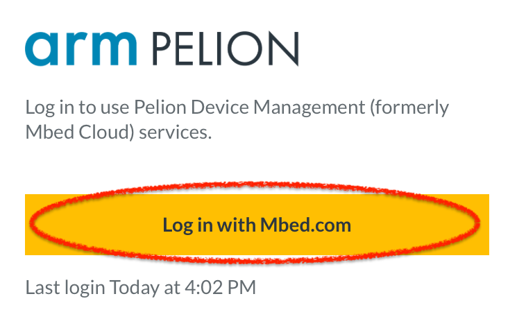|
|:-:|

さらに画面が遷移し、Pelion Portal のコンソール画面がでてきますが、ここでライセンス条項への同意が必要になります。

|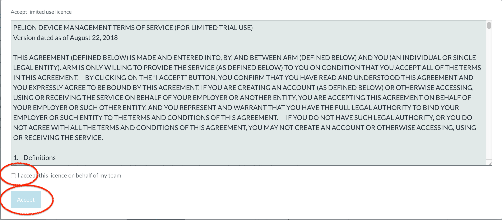|
|:-:|

同意する場合は *I accept this license on behalf of my team* にチェックを入れて、*Accept* ボタンをクリックしてください。

完了すると、Pelion Devie Management Portal のダッシュボードが現れます。

## API キーを入手する

Mbed Studio と Pelion Device Management を連携させるのに必要な API キーを入手します。 Pelion Device Management Portal の左側のメニューから *Access management* > *API keys* をクリックすると、API キーの管理画面に移ります。右上に *+ NEW API KEY* というリンクがあるのでクリックしてください。

|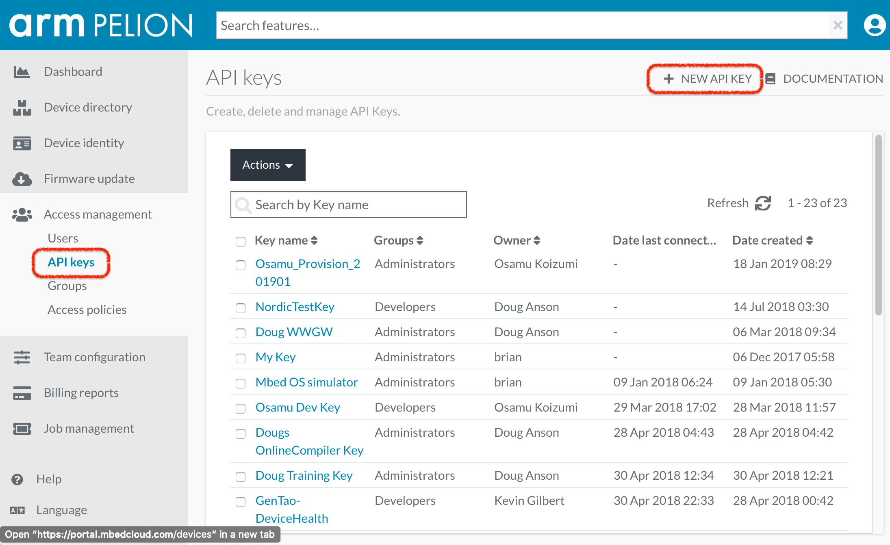|
|:-:|

API キーを作成するダイアログが出てきます。API key name には API キーにつける名前（適当なもので構いません）、Group は *Administrator* を選択してください。そして *Create API Key" ボタンをクリックして作成します。

|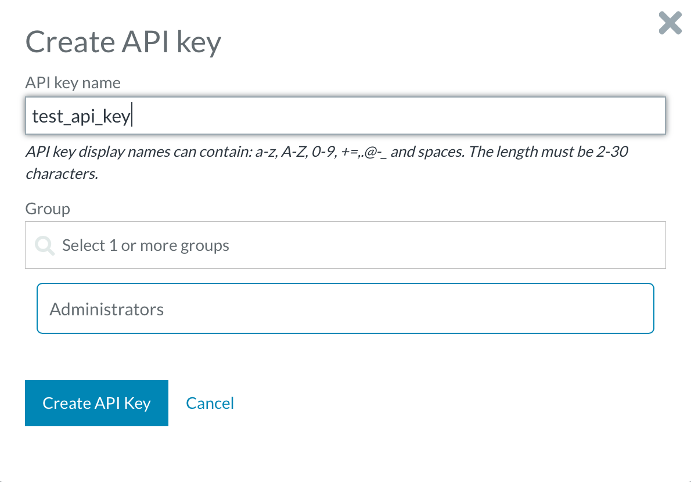|
|:-:|

API キーの作成が完了すると表示されます。この API キーはあとで使用します。一度しか表示されませんので、必ずコピーして手元に保管しておいてください。

|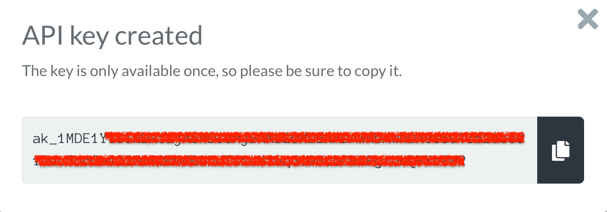|
|:-:|


以下、ワークショップ本編です。

# ハードウェアのセットアップ

Grove Starter Kit を次の設定でセットアップします。

||モジュール|シールドコネクタ|
|:-|:-:|:-:|
|温度センサ|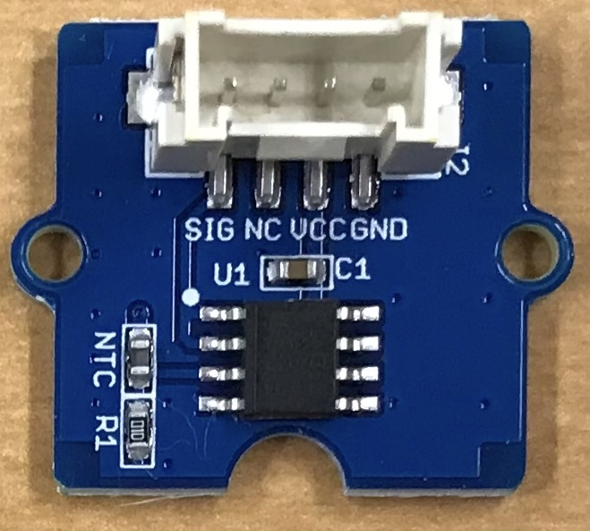| A0 |
|明るさセンサ|| A1 |
|プッシュボタン|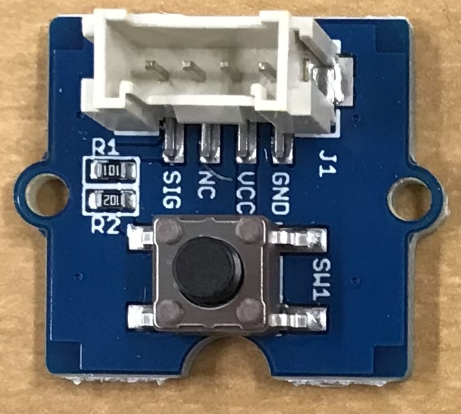| D2 |
|ブザー|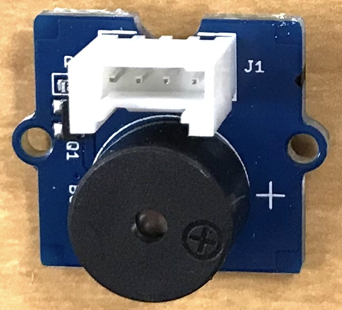| D3 |

Grove のシールドを FRDM-K64F と組み合わせると次の写真のようになります（写真はイーサネットケーブルも接続しています）。

|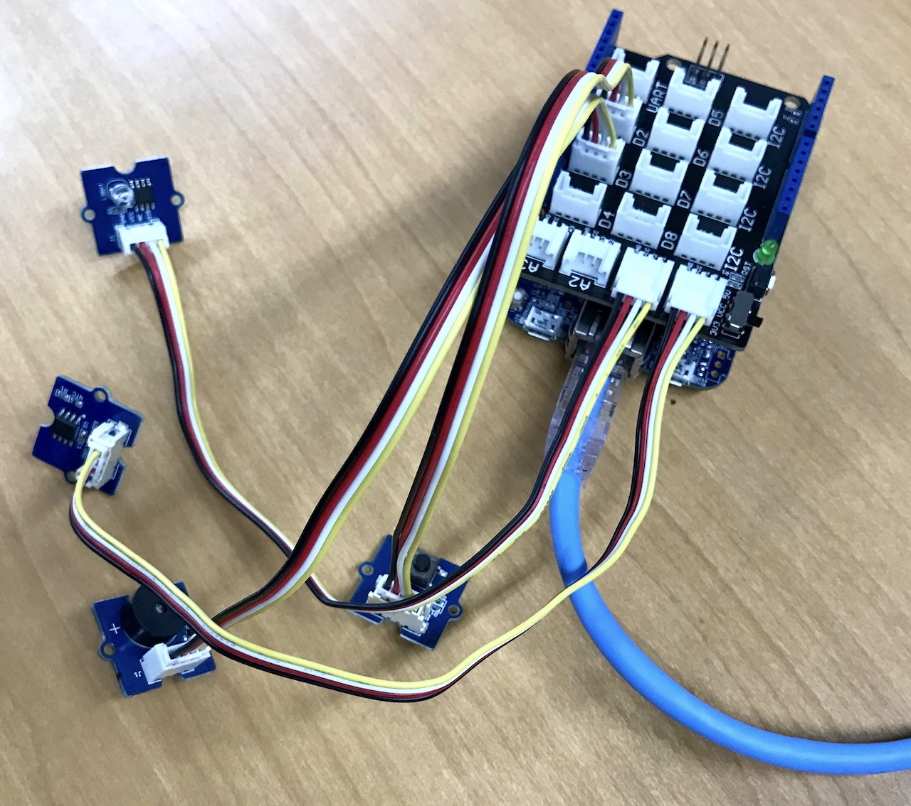|
|:-:|

# ファームウェアを作成する

Pelion Device Management と連携するために必要な Pelion Device Management Client を含むファームウェアを作成し、IoT デバイスに適用します。

## Mbed Studio を起動する

初めて Mbed Studio を起動すると次の画面が現れます。

|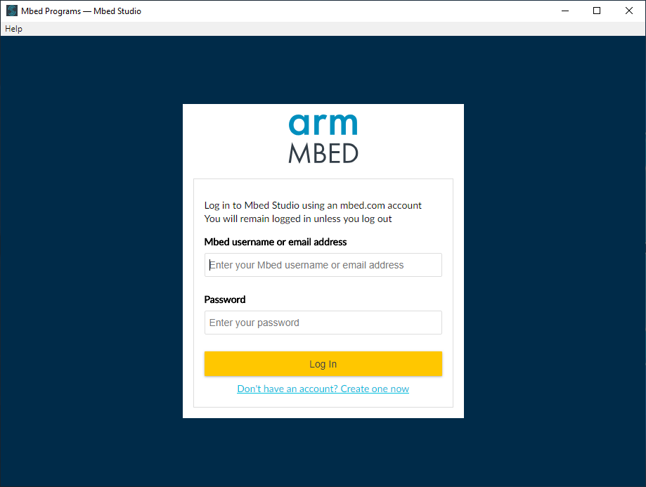|
|:-:|

Mbed アカウントの、Eメールアドレスまたはユーザ名と、パスワードを入力してログインしてください。

## プロジェクトをインポートする

IoTデバイスに書き込むファームウェアを作成するためのプロジェクトをインポートします。 Mbed Studio のウィンドウ上側にあるメニューから *File > Import Program* を選択してください。インポート元を指定するためのダイアログが現れます。

|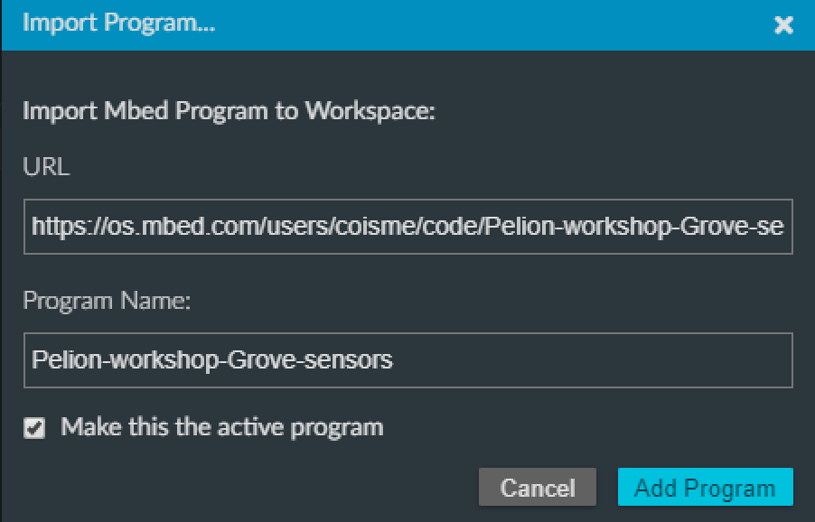|
|:-:|

URL に次の URL を入力してください。 *Program Name* は URL から自動的に生成されます。URL を入力したら *Add Program* ボタンをクリックしてインポートを開始します。

https://github.com/coisme/Pelion-workshop-Grove-sensors

インポートが完了するとワークスペースに *Pelion-workshop-Grove-sensors* ができています。

|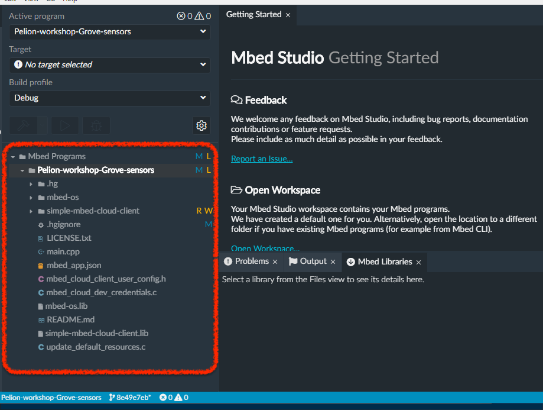|
|:-:|

## ターゲットを設定する

ターゲットボードを FRDM-K64F に設定します。*Target*ラベルの下のボックスをクリックするとボードの検索ができます。*K64F*と入力すると、今回のターゲットボードである *FRDM-K64F* が出てくるので、それを選択してください。

|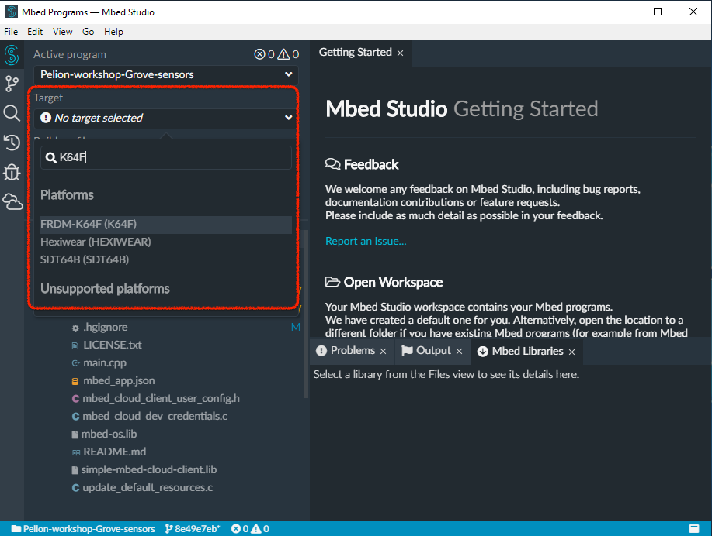|
|:-:|

## API キーを設定する

Mbed Studio に Pelion Device Management と連携するため API キーを設定します。ウィンドゥ左に並んだアイコンの中から、雲マークのものをクリックしてください。Pelion Device Management の画面になります。API キーを入力するためのボックス *Pelion API Key* がありますので、事前準備で手元に保管した API キーをこちらに入力して *OK* ボタンをクリックしてください。

|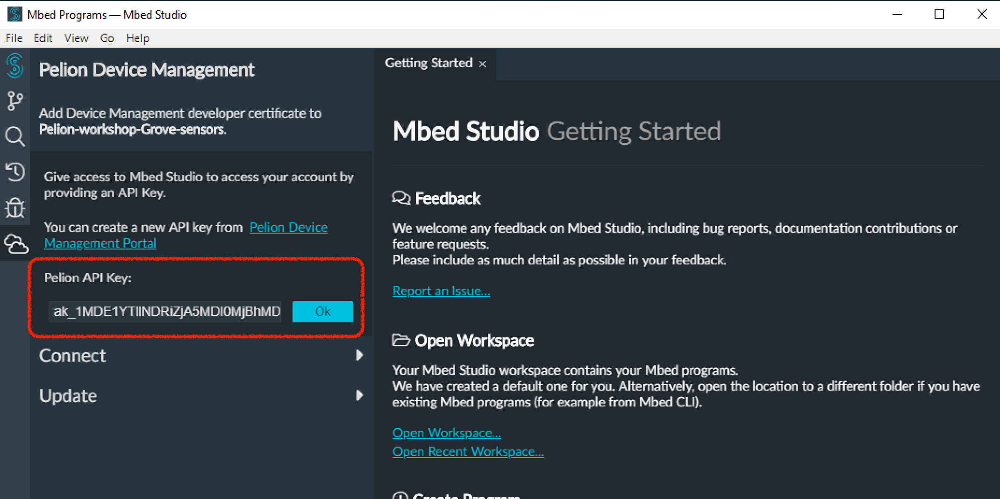|
|:-:|

## 開発者用証明書を作成する

IoT デバイス認証のための証明書情報等を含むファイルを生成します。Pelion Device Management 画面で、*Connect* を開いてください。証明書一覧が出てきます。最初は一覧が空欄ですので、*Create* ボタンをクリックして証明書を作成します。名前を入力するボックスが出てきますので、適当な名前を入力してから *OK* ボタンをクリックしてください。開発者用証明書が作成されます。

|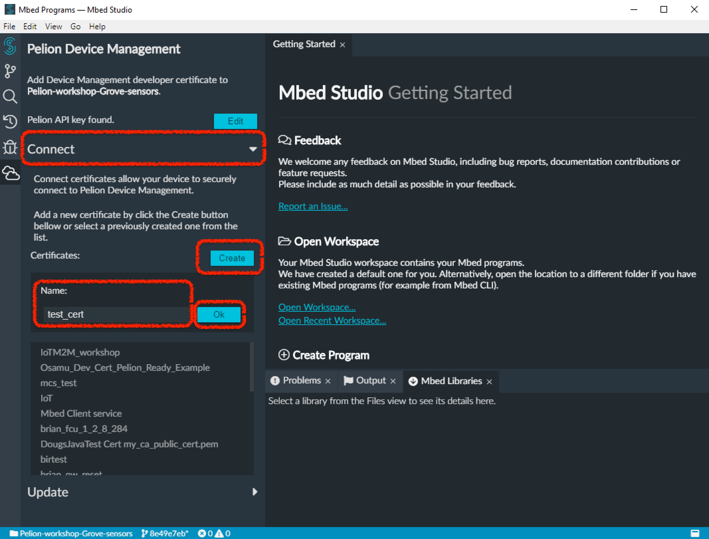|
|:-:|

作成された証明書にカーソルを合わせると、証明書名の右側に「+」アイコンが出てきますので、それをクリックしてください。開発者用証明書がプロジェクトに追加されます。

## アップデート用証明書等を作成する

ネットワーク経由でファームウェアをアップデートするときにダウンロードしたファームウェアを検証するために使用する、証明書と秘密鍵を生成します。Pelion Device Management 画面で、*Update* を開いてください。 *Apply Update Certificate* というボタンがありますのでクリックしてください。証明書と秘密鍵が作成され、プロジェクトに追加されます。

## ボードとパソコンを接続する

ボードとパソコンを USB ケーブルで接続します。USB の口が二つありますので、下記の写真を参考にして RESET ボタンに近い側のコネクタに接続してください。

|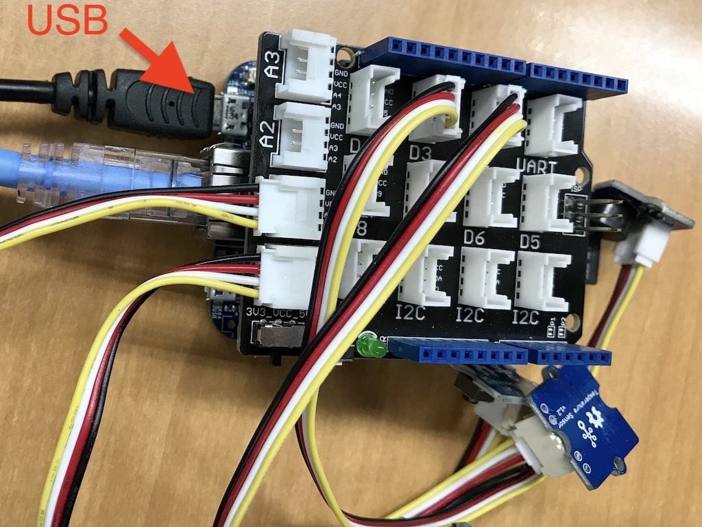|
|:-:|

ボードを接続して PC に認識されると Target にシリアル番号（S/N: ....）が表示され、実行とデバッグのアイコンが現れます。

|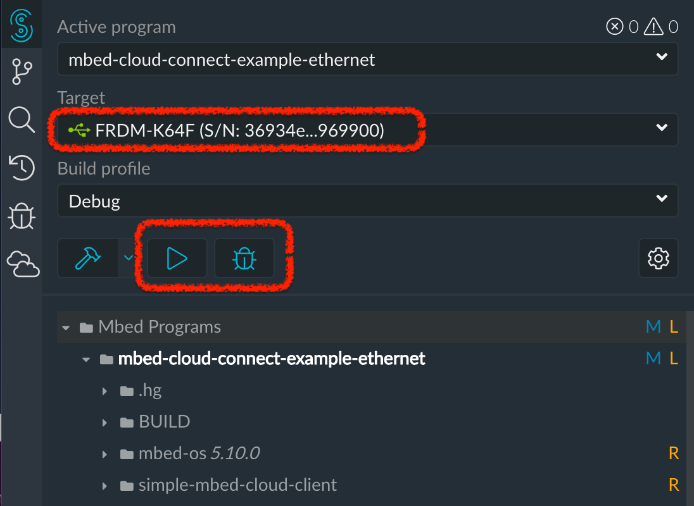|
|:-:|

## シリアルモニタを接続する

コマンドプロンプトを開いて、以下のコマンドを実行してください。シリアルターミナルが開きます。

```
mbed sterm -b 115200
```

（このセクションは、シリアルモニタが Mbed Studio に搭載されたら、そちらを使用するように変更します。）

# ファームウェアのビルドと実行

IoTデバイスに書き込むファームウェアをビルドします。画面中にある実行ボタン（▶︎）をクリックしてください。ファームウェアのビルドが始まります。ビルドには数分かかる場合があります。

|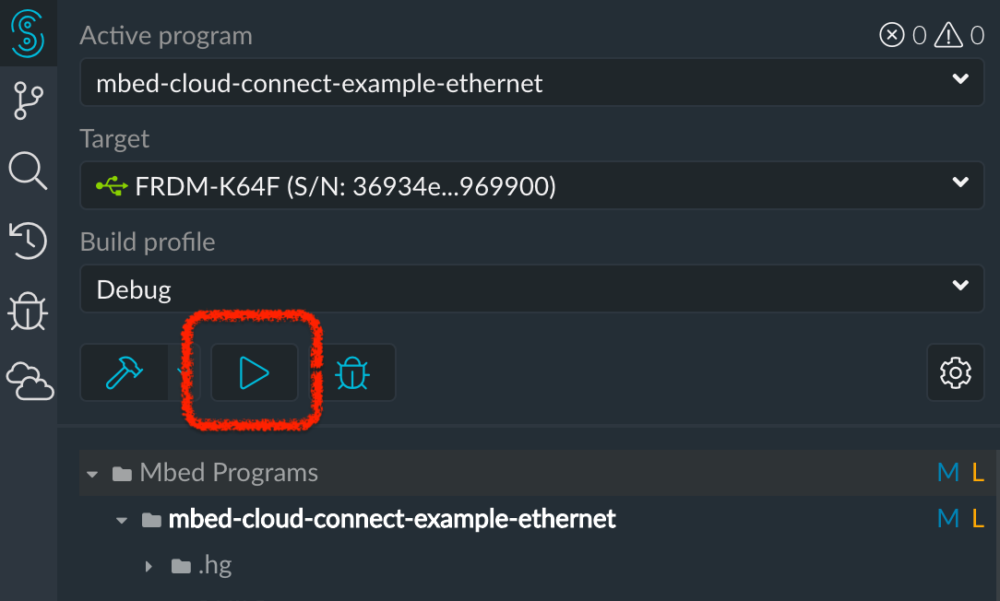|
|:-:|

ビルドが完了すると、自動的にターゲット（FRDM-K64F）へファームウェアが書き込まれます。ファームウェアの書き込みが完了すると、 IoT デバイスがリセットされて書き込んだファームウェアが起動します。このときシリアルターミナル上に起動時のログが流れます。以下は起動時のシリアル通信ログの一例です。環境によって一部の表示が異なります。

```
[BOOT] Mbed Bootloader
[BOOT] ARM: 00000000000000000000
[BOOT] OEM: 00000000000000000000
[BOOT] Layout: 0 70E4
[BOOT] Active firmware integrity check:
[BOOT] [++++++++++++++++++++++++++++++++++++++++++++++++++++++++++++++++++++++]
[BOOT] SHA256: 2980B571D1BF6D679FE5EB4AA3D911D39024363C608066707236D2321DEA0CB3
[BOOT] Version: 1552568142
[BOOT] Slot 0 is empty
[BOOT] Active firmware up-to-date
[BOOT] Application's start address: 0xA400
[BOOT] Application's jump address: 0xAAF9
[BOOT] Application's stack address: 0x20030000
[BOOT] Forwarding to application...

Starting Simple Mbed Cloud Client example
Connecting to the network using Ethernet...
Connected to the network successfully. IP address: 192.168.0.12
[SMCC] Autoformatting the storage.
[SMCC] Reset storage to an empty state.
[SMCC] Starting developer flow
Initialized Mbed Cloud Client. Registering...
Connected to Mbed Cloud. Endpoint Name: 01697c4734c5000000000001001000b6
```

最後に `Connected to Pelion Device Management. Endpoint Name: XXXXXXXXXXXXXXXXXXXXXX` が表示されれば Pelion Device Management への接続が成功しています。接続までには1、2分ほどかかることがあります。 `XXXXXXXXXXXXXXXXX` （上の表示では `01697c4734c5000000000001001000b6` ）はエンドポイント名（デバイスID）です。後ほど使用しますのでメモしておいてください。

もしファームウェア書き込み後に何も表示されない場合は、ボード上の `RESET` ボタンを押してください。 IoT デバイスがリセットされます。


## Pelion Device Management Portal で確認する

Pelion Device Management Portal 上で、デバイスツリーにデバイスが登録されていることを確認してみましょう。次の URL から Pelion Device Management Portal を開いてください。

https://portal.mbedcloud.com/

途中、ログインを求められたときは *Log in with your Mbed.com account* をクリックしてください。

|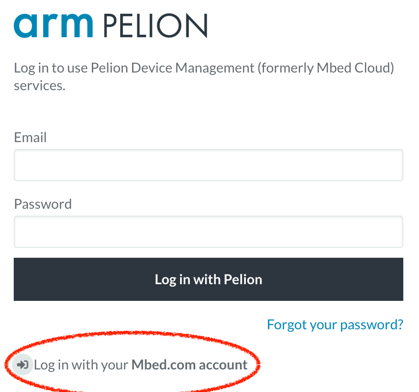|
|:-:|

そして、次に出てくる *Log in with Mbed.com* をクリックしてください。 Mbed アカウントでログインします。

|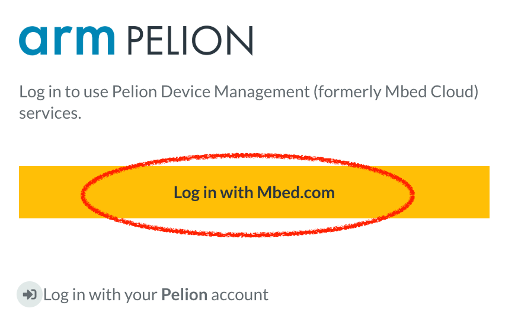|
|:-:|


ログインが完了すると Usage Dashboard が表示されます。画面左のメニューの `Device Directory` をクリックするとデバイス一覧が表示されます。今回は先ほど接続した一台が表示されるはずです。

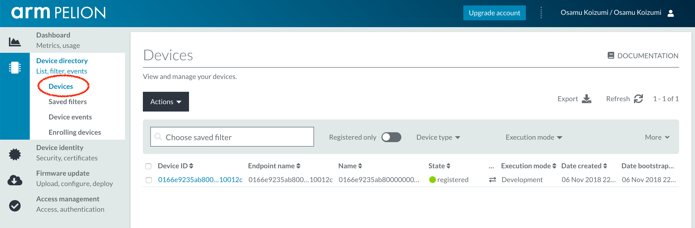

リストに表示されているデバイス名をクリックするとデバイスの詳細画面が表示されます。デバイス詳細の表示の中にある *RESOURCES* タブをクリックしてください。

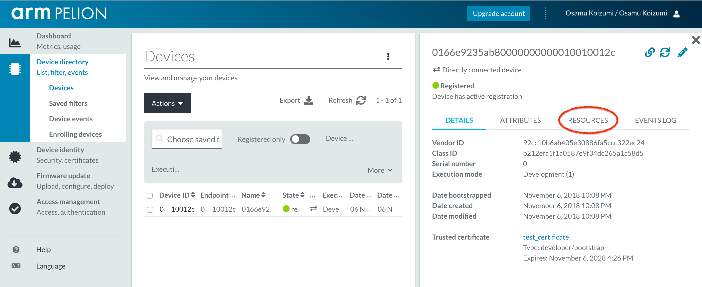

IoT デバイスに登録されているリソース一覧が表示されます。この中から `button_count` ( `/3200/0/5501` ) というリソースを探し、クリックしてください。このリソースは IoT デバイス上のボタンプッシュボタンに対応します。現時点では FRDM-K64F 上の `SW2` ボタンのみが割り当てられています。

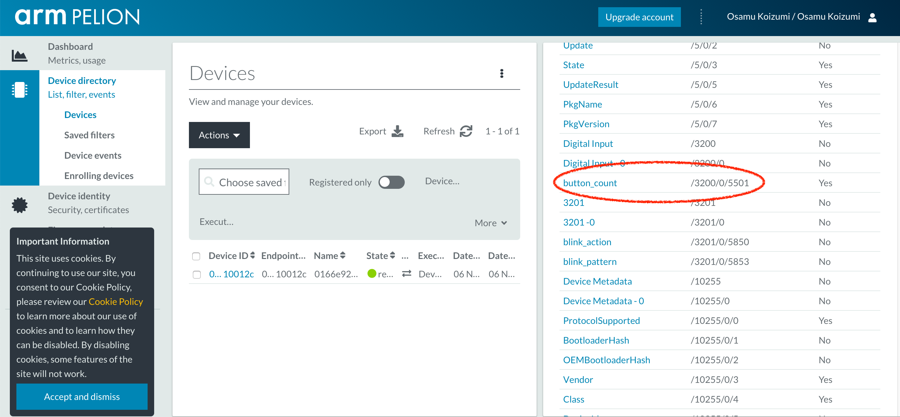

クリックすると、モニタ画面が表示され、リソースの状態をモニタすることができます。 `SW2` ボタンを押すたびに、 `Value` の値が増え、グラフが更新される様子が見られます。

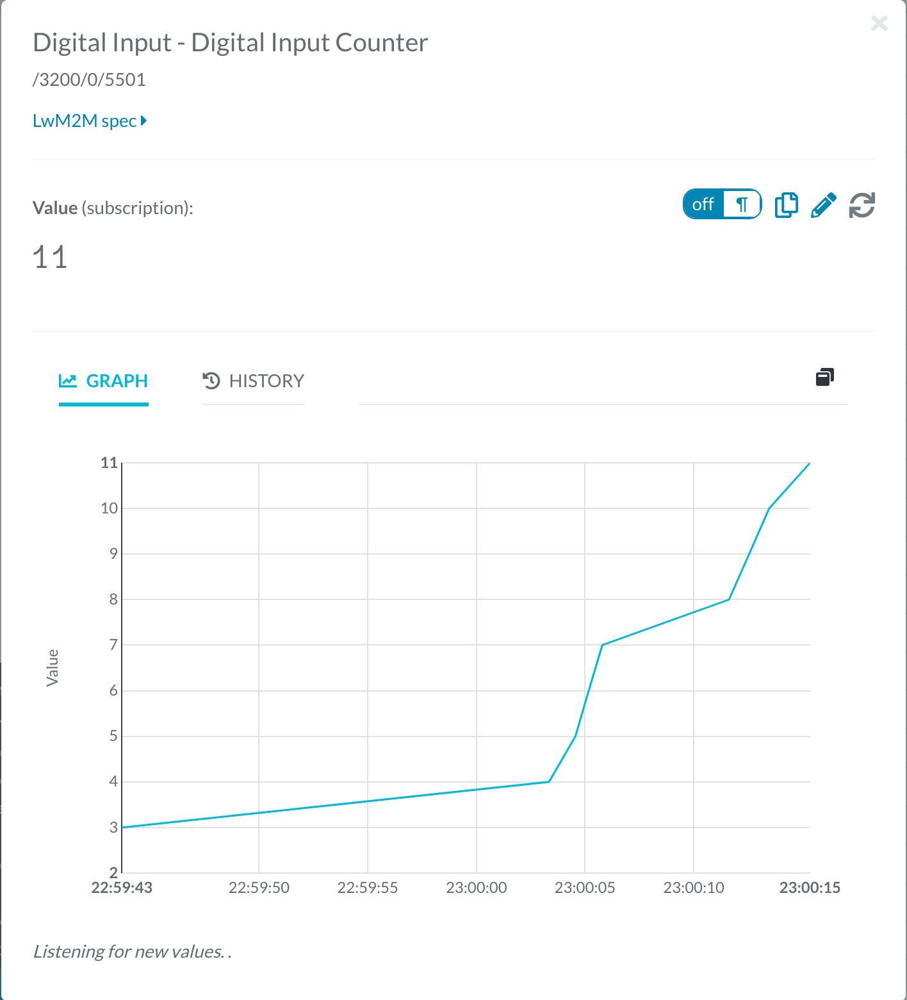


# Grove Starter Kit を追加する

先ほどビルドしたファームウェアでは Grove Starter Kit のセンサやボタンは有効化されていません。Pelion Device Management にも表示されていません。これらを有効化して、ネットワーク経由でファームウェアを更新してみましょう。

## ENABLE_GROVEマクロを有効化する

本ワークショップでは新たにコードを書く時間を節約するため、プリプロセッサによるコンパイルスイッチでセンサのコードを有効化できるようにしてあります。センサを有効化するにはマクロ `ENABLE_GROVE` を定義します。

`main.cpp` ファイルの先頭のほうにある `//#define ENABLE_GROVE` という行を探してください。コメントアウトされています。この状態では Grove Starter Kit が有効化されていないので、先頭の `//` を削除してマクロ定義を有効化してください。

|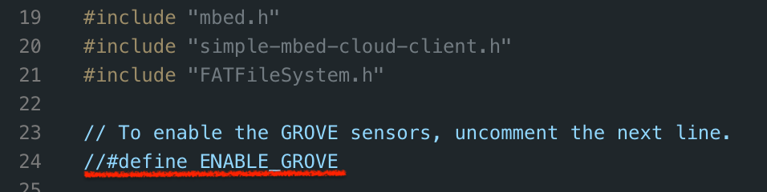|
|:-:|

これで `main.cpp` 中の、 `#ifdef ENABLE_GROVE` と `#endif /* ENABLE_GROVE */` で囲まれたセンサ関連のコードが有効化されます。


# ファームウェアをネットワーク経由で更新する

センサのコードを追加したファームウェアをネットワーク経由で更新してみましょう。

ワークショップでは手元に IoT デバイスがあるので、 USB 経由で更新するのとあまり手間が変わらないように思えるかもしれません。しかし、 IoT デバイスは大量かつ広範囲に設置されることが想定されます。それを人がひとつひとつ更新してまわるのは現実的ではありません。ネットワーク経由でファームウェアを更新できることが必須であると言えます。

## アップデート用ファームウェアとマニフェストを作成する

Mbed Studio の Pelion の画面で、Update の項目を選択し開きます。そして *Publish To Pelion* ボタンをクリックしてください。

|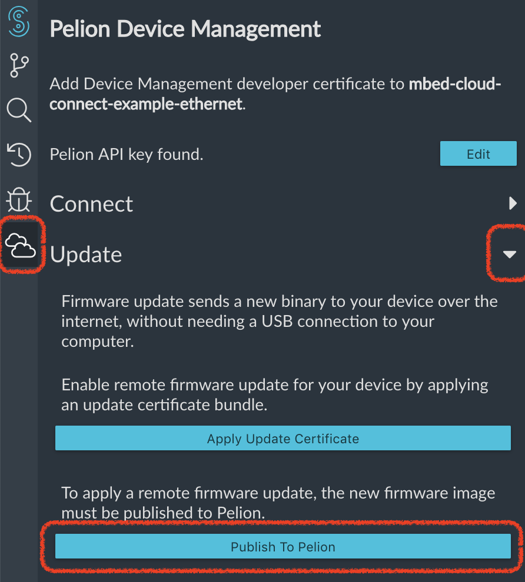|
|:-:|

次の画面がでてきますので、Name にマニフェスト名を入力してください。Description には説明を入力しますが、空でも構いません。入力したら *Sign & Upload Firmware Update* をクリックします。アップデート用ファームウェアイメージのビルドとアップロード、マニフェストの作成、署名、アップロードが行われます。

|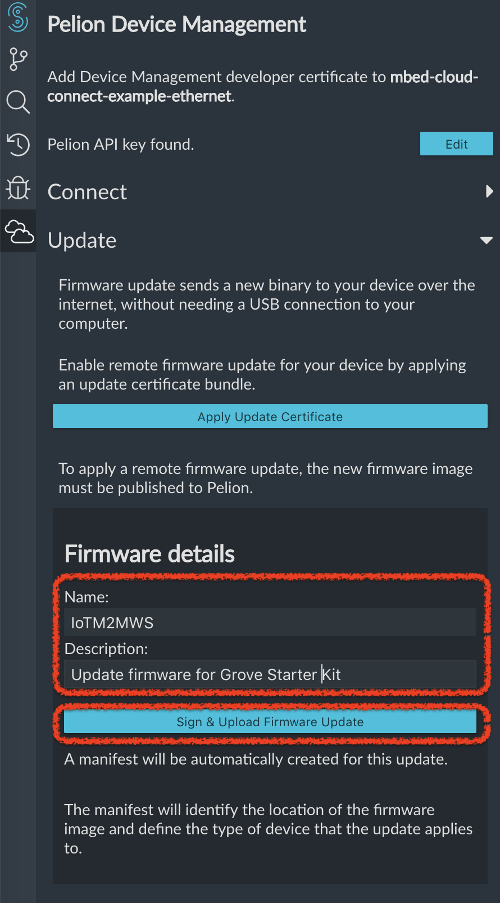|
|:-:|

すべて完了したら、以下の URL から Pelion Device Management Portal を開きます。すでに開いている場合はそちらを利用してください。

https://portal.mbedcloud.com/


## アップデートキャンペーンを準備する

ファームウェアイメージとマニフェストがアップロードされ準備できましたので、実際にファームウェアアップデートを行うための準備をします。

Pelion Device Management を開いてください。左側のメニューから *Firmware Update* > *Image* を選択すると、先の手順でアップロードしたファームウェアが確認できます。また、*Firmware Update* > *Manifest* を選択するとマニフェストが確認できます。

ファームウェアイメージとマニフェストがアップロードされていることを確認できたら、ファームウェアアップデートを実施するための *キャンペーン* ドラフトを作成するウィザードを開きます。画面左のメニューから *Firmware update* > *Update campaign* を選択すると次の画面が出てきます。画面右上の *+NEW CAMPAIGN* をクリックし、*New update campaign wizard* をクリックします。

|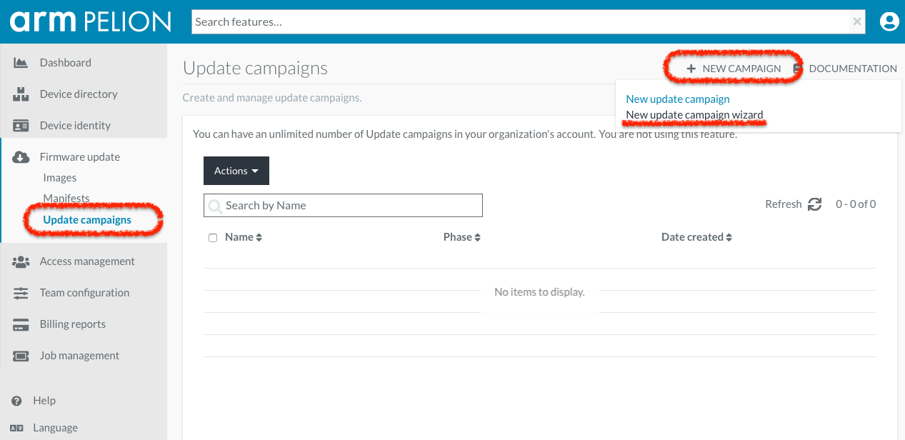|
|:-:|

すると、アップデートキャンペーンを作成するためのウィザード画面になります。

最初のステップではキャンペーンの名称と説明を入力します。名称は自動で入力されているので、そのままでも構いませんし、変更しても構いません。説明は空欄でも構いません。入力したら *Next* ボタンをクリックします。

|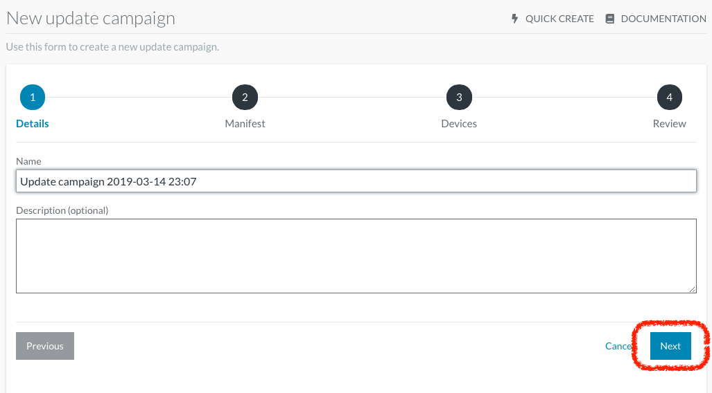|
|:-:|

ステップ 2 ではマニフェストを選択します。先ほどアップロードしたマニフェストを選択して、*Next* ボタンをクリックしてください。

|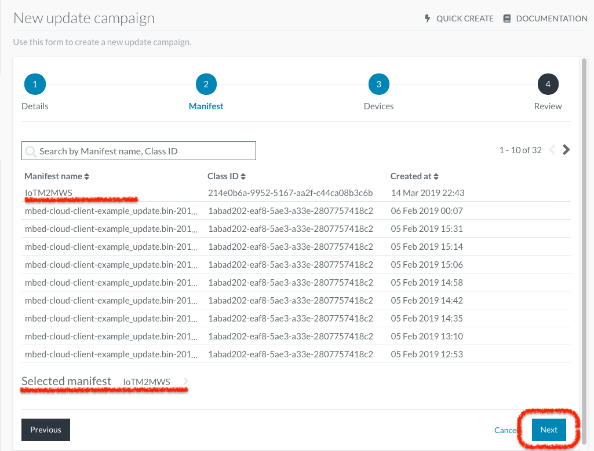|
|:-:|

ステップ 3 ではキャンペーンを適用する IoT デバイスを選択します。 *Select device* を選択すると IoT デバイスのリストが表示されます。先の手順でメモしたデバイス ID をもつ IoT デバイスを選択して、 *Next* をクリックします。

|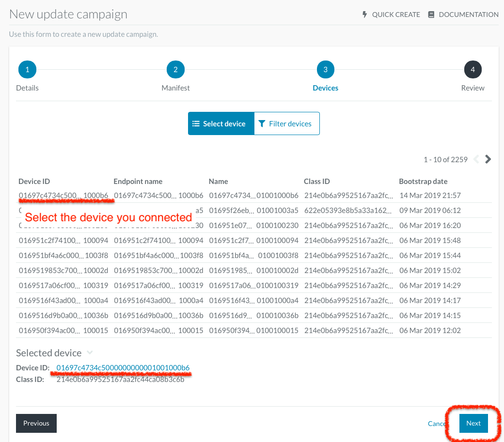|
|:-:|

最後に、ステップ 4 ではキャンペーンの詳細を確認します。問題がなければ *Finish* をクリックします。アップデートキャンペーンのドラフトが作成されます。

|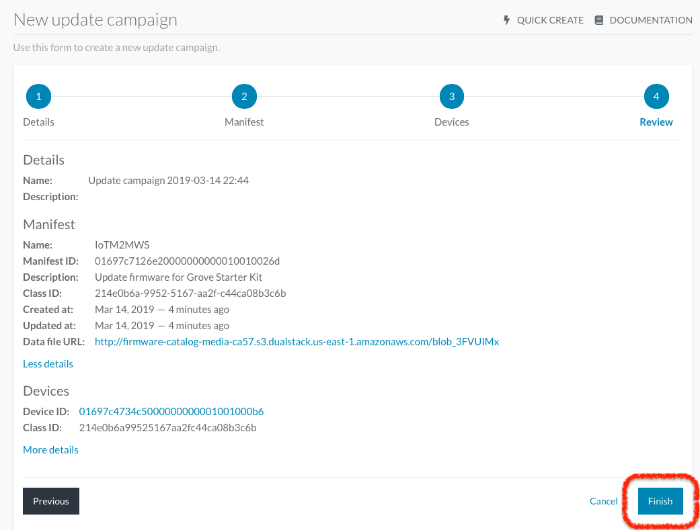|
|:-:|


## アップデートキャンペーンを実施する

作成したアップデートキャンペーンのドラフトが表示されます。 *Start* をクリックしてキャンペーンを開始します。確認画面が出たら、確認の上、進めてください。

|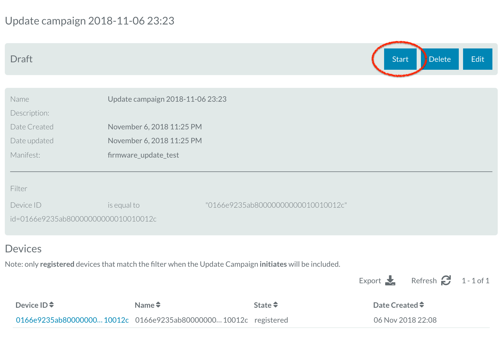|
|:-:|

アップデートが始まるとステータスが `Active` になります。

|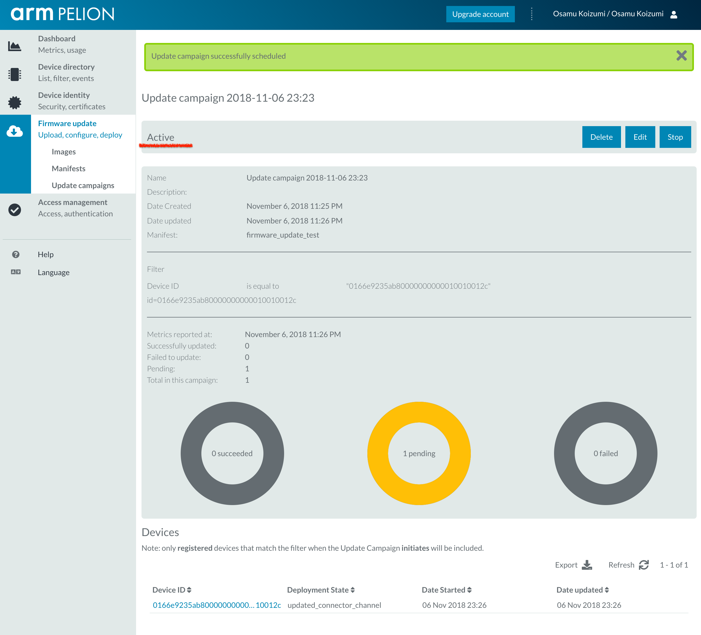|
|:-:|

IoT デバイスのシリアルモニタにはファームウェアイメージのダウンロードの進捗が表示されます。

```
Firmware download requested
Authorization granted
Downloading: [+++|                                              ] 6 %
```

IoT デバイスへのファームウェアダウンロードが正常に終了すると、ステータスが *Stopped: Threshold 100.00% reached.* と表示されます。

|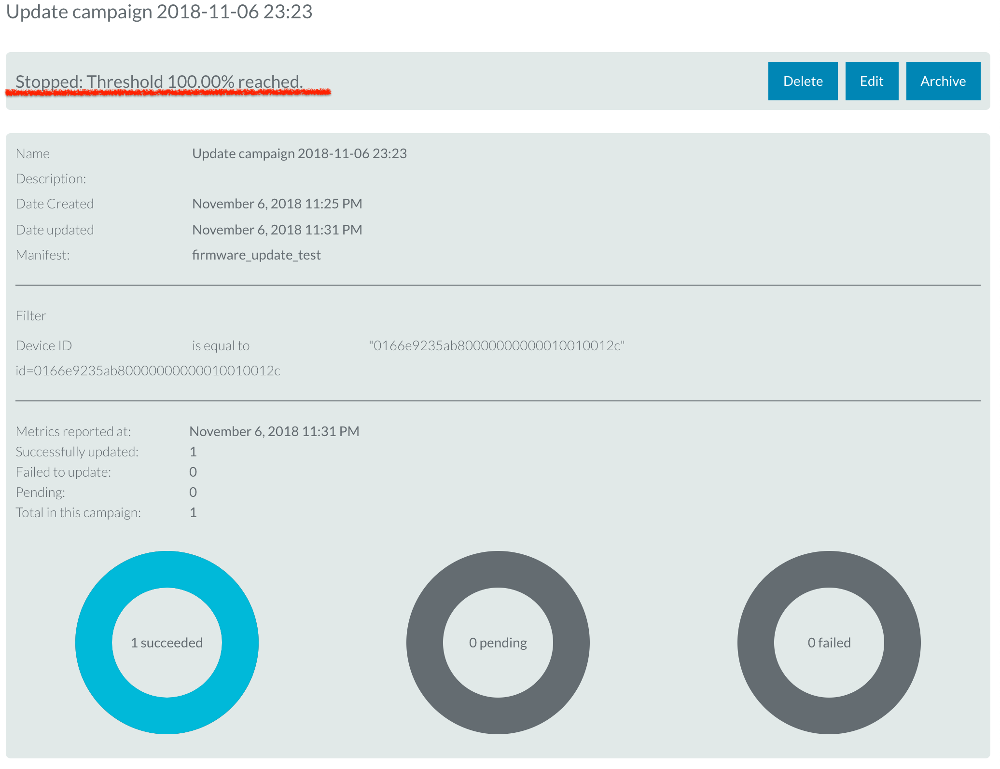|
|:-:|


IoT  デバイス側では、ファームウェアイメージのダウンロードが完了すると、内容が検証され、 IoT デバイスが自動的に再起動します。

## ファームウェアがアップデートされたことを確認する

IoT デバイスが再起動すると、ダウンロードした新しいファームウェアイメージが起動します。シリアルモニタ上ではセンサの値が表示されるようになっているはずです。

```
Firmware download requested
Authorization granted
Downloading: [++++++++++++++++++++++++++++++++++++++++++++++++++] 100 %
Download completed
Firmware install requested
Authorization granted
[BOOT] Mbed Bootloader
[BOOT] ARM: 00000000000000000000
[BOOT] OEM: 00000000000000000000
[BOOT] Layout: 0 70E4
[BOOT] Active firmware integrity check:
[BOOT] [++++++++++++++++++++++++++++++++++++++++++++++++++++++++++++++++++++++]
[BOOT] SHA256: 2980B571D1BF6D679FE5EB4AA3D911D39024363C608066707236D2321DEA0CB3
[BOOT] Version: 1552568142
[BOOT] Slot 0 firmware integrity check:
[BOOT] [++++++++++++++++++++++++++++++++++++++++++++++++++++++++++++++++++++++]
[BOOT] SHA256: C6EB9BCC2DFFBE42440FB11625BA7206764062FAE8D063613A558DC4BFBE824A
[BOOT] Version: 1552570983
[BOOT] Update active firmware using slot 0:
[BOOT] [++++++++++++++++++++++++++++++++++++++++++++++++++++++++++++++++++++++]
[BOOT] Verify new active firmware:
[BOOT] [++++++++++++++++++++++++++++++++++++++++++++++++++++++++++++++++++++++]
[BOOT] New active firmware is valid
[BOOT] Application's start address: 0xA400
[BOOT] Application's jump address: 0xAAF9
[BOOT] Application's stack address: 0x20030000
[BOOT] Forwarding to application...

Starting Simple Mbed Cloud Client example
Connecting to the network using Ethernet...
Connected to the network successfully. IP address: 192.168.0.12
[SMCC] Starting developer flow
[SMCC] Developer credentials already exist
Initialized Mbed Cloud Client. Registering...
Sensor values: temperature  8.3 C, illuminance 15084
Connected to Mbed Cloud. Endpoint Name: 01697c4734c5000000000001001000b6
Sensor values: temperature -4.7 C, illuminance 14723
```

また、 Pelion Device Management Portal のデバイスリソース一覧をみると、ファームウェアアップデート前にはなかったリソースのブザー（buzzer）、照度センサ（illuminance）、温度センサ（temperature）が追加されています。

|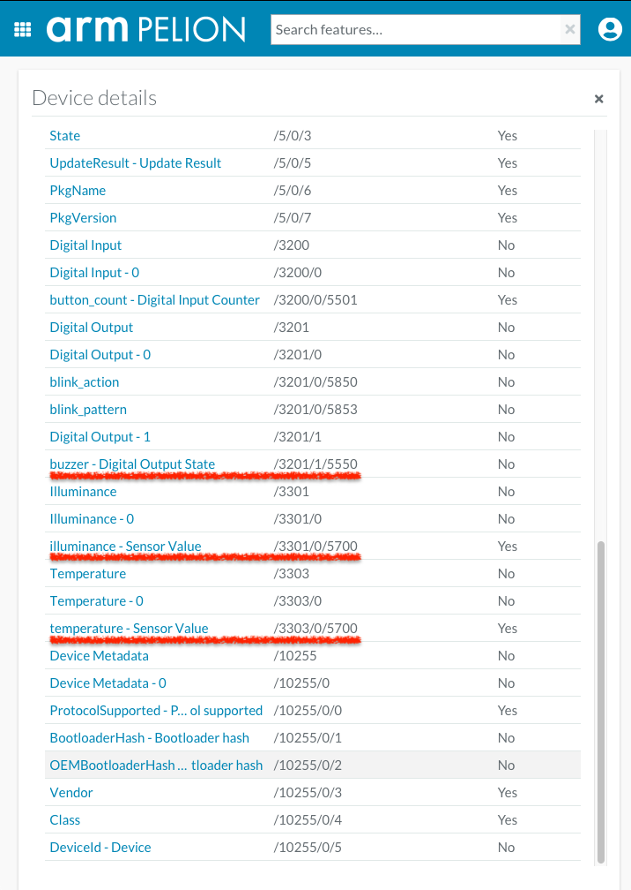|
|:-:|

# Pelion Device Management で IoT デバイスを制御する

## センサ値を取得する

Pelion Device Management でリソースの値を取得することができます。例えば温度センサリソース（temperature /3303/0/5700）をクリックすると、温度センサの値を取得し、グラフにして見ることができます。温度センサの値はファームウェアプログラムで3秒毎に更新されるようになっています。

|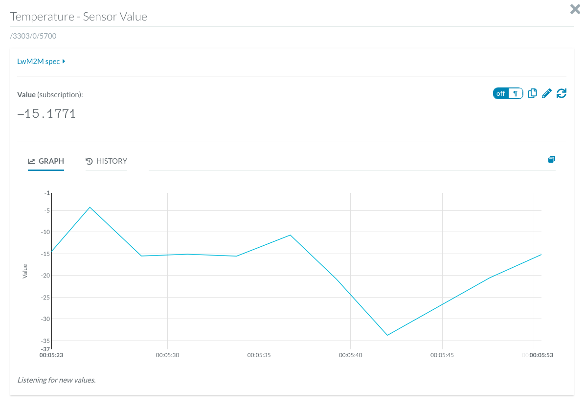|
|:-:|

## 出力する

リソースに値を書き込むことで IoT デバイスをを制御することができます。今回作成した IoT デバイスは、ブザーリソース（buzzer /3201/1/5550）に POST リクエストが送信されるとブザーが鳴るようにプログラムされています。ブザーリソースをクリックして次の画面を表示させます。

|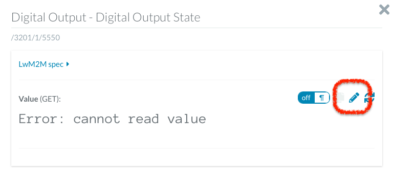|
|:-:|

値は取得できないように設定してありますので、*Error: cannot read value* と出てきます。リソースに値を書き込むために右側にある鉛筆マークのアイコンをクリックします。すると次のダイアログが現れますので、*Post* を選択し、値に `1` を入力し、Sendボタンをクリックしてください。

|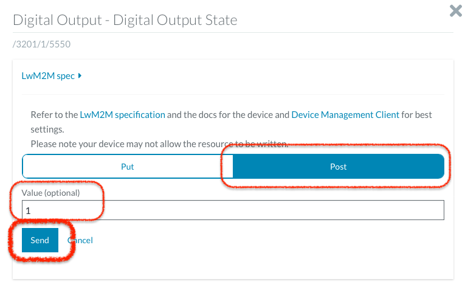|
|:-:|

デバイスが POST リクエストを受け取ると、Grove Shield に接続されたブザーが 0.5 秒間だけ鳴ります。

